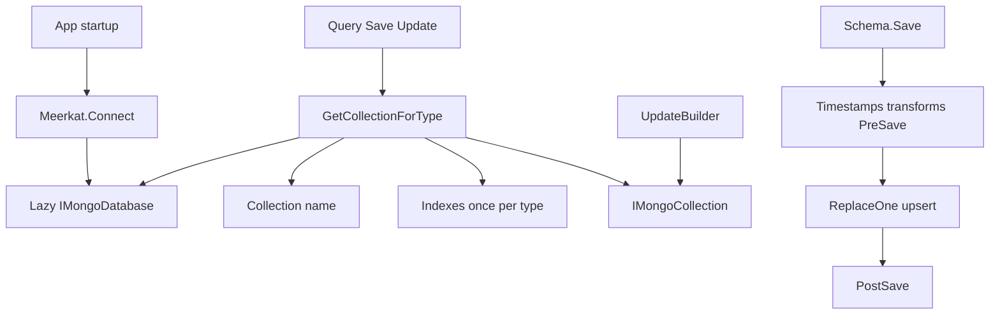

# Architecture

This document outlines the internal architecture, design principles, runtime model, and request flows of Meerkat.

---

## 1. Purpose & Design Goals

Meerkat is designed as a thin, strongly-typed Object Document Mapper (ODM) on top of the official `MongoDB.Driver` for .NET (`netstandard2.0`).

- **Assembly**: `Meerkat`
- **Package**: `meerkat`
- **Underlying Driver**: `MongoDB.Driver` (3.x)

Its primary goal is to eliminate boilerplate data-access code and provide intuitive ActiveRecord-style and static querying ergonomics while retaining direct escape hatches to the raw MongoDB driver whenever advanced functionality is required.

---

## 2. Repository Layout

The repository is organized into the core library and a comprehensive test suite:

- `src/meerkat`: The .NET Standard 2.0 library containing the ODM logic.
- `src/meerkat.Tests`: The unit and integration test suite targeting modern .NET.

### Feature-Split Partials

The core static class `Meerkat` is organized across focused partial classes grouped by responsibility:

| File | Responsibility |
| :--- | :--- |
| `Meerkat.cs` | Connection initialisation (`Connect`), lazy database/client access, session storage, and core collection retrieval. |
| `Meerkat.Collections.cs` | Resolution of `IMongoCollection<TSchema>` from types and trigger for index creation. |
| `Meerkat.Queries.cs` | Implementation of `FindById`, `FindOne`, and `Find` (sync and async). |
| `Meerkat.Removals.cs` | Implementation of `RemoveById`, `RemoveOne`, `Remove`, `HardRemove*`, and `Restore*`. |
| `Meerkat.Counting.cs` | Implementation of `Count` and `CountAsync` overloads. |
| `Meerkat.Updates.cs` | Atomic numeric increment and decrement operations (`IncrementById`, `DecrementByFilter`, etc.). |
| `Meerkat.PartialUpdates.cs` | Entry points for fluent partial updates (`Update`, `UpdateOne`, `UpdateMany`, `UpdateByFilter`). |
| `Meerkat.Indexing.cs` | Index reflection, creation, and startup verification (`EnsureIndexes`). |
| `Meerkat.SoftDelete.cs` | Soft-delete filter creation, update definitions, and helper queries. |
| `Meerkat.Transactions.cs` | Ambient session management and transaction execution (`WithTransaction`). |

Other core files include:

- `Schema.cs`: The generic base class `Schema<TId>` implementing `Save()`, `SaveAsync()`, `Delete()`, timestamps, and lifecycle hooks.
- `Updates/UpdateBuilder.cs`: Fluent builder for constructing MongoDB update definitions.
- `Collections/Enumerables.cs`: `SaveAll` and `SaveAllAsync` extension methods on `IEnumerable<TSchema>`.
- `Attributes/*`: Attributes for configuration (`[Collection]`), indexing (`[SingleFieldIndex]`, `[UniqueIndex]`, `[CompoundIndex]`, `[GeospatialIndex]`), and casing (`[Lowercase]`, `[Uppercase]`).

---

## 3. Public API Surface

Meerkat exposes its capabilities through three primary paradigms:

1. **Static `Meerkat` API**: Static generic methods taking `<TSchema, TId>` for data querying, counting, existence checks, removals, updates, and transactions.
2. **Generic `Schema<TId>` Base Class**: Instance methods on models (`Save`, `SaveAsync`, `Delete`, `DeleteAsync`) and overridable lifecycle hooks (`PreSave`, `PostSave`).
3. **Declarative Attributes**: Class- and property-level metadata controlling collection names, indexing rules, TTLs, and string transformations.
4. **Extension Methods**: `SaveAll` and `SaveAllAsync` on `IEnumerable<TSchema>` in the `meerkat.Collections` namespace.
5. **Escape Hatch**: `Meerkat.Collection<TSchema, TId>()`, `Meerkat.Database`, and `Meerkat.Client` provide direct, unrestricted access to native MongoDB driver types (`IMongoCollection<TSchema>`, `IMongoDatabase`, `IMongoClient`).

---

## 4. Runtime Model

### Connection Initialisation

Calling `Meerkat.Connect(connectionString)`:
1. Parses the connection string using `ciu-parser` (`CredentialsParser.Parse`) to split the URL and target database name.
2. Instantiates `Lazy<IMongoClient>` and `Lazy<IMongoDatabase>`. Connection creation and database binding are deferred until the first operation executes.

### Collection Resolution & Caching

Every operation routes through `GetCollectionForType<TSchema, TId>()`:
1. **Name Resolution**: Inspects `[Collection(Name = "...")]` on the schema type. If omitted, derives the name using `PluralizationService` (lowercased and pluralized, e.g., `BlogPost` → `blogposts`).
2. **Index Initialization (Once per Type)**: Checks `ConcurrentDictionary<string, bool> SchemasWithCheckedIndices`. If the schema type has not yet been processed in the current process lifetime, Meerkat inspects index attributes on the type, builds the corresponding MongoDB index models, and creates them asynchronously on the collection.
3. **Ambient Session Binding**: If an active ambient transaction exists in `AsyncLocal<IClientSessionHandle?> CurrentSession`, operations automatically join the session.

---

## 5. Write Paths: Replace Upsert vs. Operator Updates

Meerkat separates write paths into two distinct categories depending on whether the full entity is being persisted or specific fields are being modified atomically:

### Full Document Upsert (`Save` / `SaveAll`)

- **Mechanism**: Issues a MongoDB `ReplaceOne` / `BulkWrite` with `IsUpsert = true`, matching by document `Id`.
- **Timestamps**: Sets `CreatedAt` on first persistence and `UpdatedAt` on every save if `TrackTimestamps = true`.
- **Transformations**: Executes string transformations (`[Lowercase]`, `[Uppercase]`).
- **Lifecycle Hooks**: Invokes `PreSave()` before the write and `PostSave()` after completion.

### Atomic Field Updates (`UpdateBuilder` & `$inc` Helpers)

- **Mechanism**: Issues MongoDB update operators (`$set`, `$unset`, `$push`, `$pull`, `$addToSet`, `$inc`) directly using `UpdateOne`, `UpdateMany`, or `FindOneAndUpdate`.
- **Timestamps**: Automatically sets `UpdatedAt` to UTC now if `TrackTimestamps = true`.
- **Bypassed Features**: Bypasses `CreatedAt`, string case transformations, and `PreSave()` / `PostSave()` lifecycle hooks since whole documents are neither deserialized nor fully rewritten.
